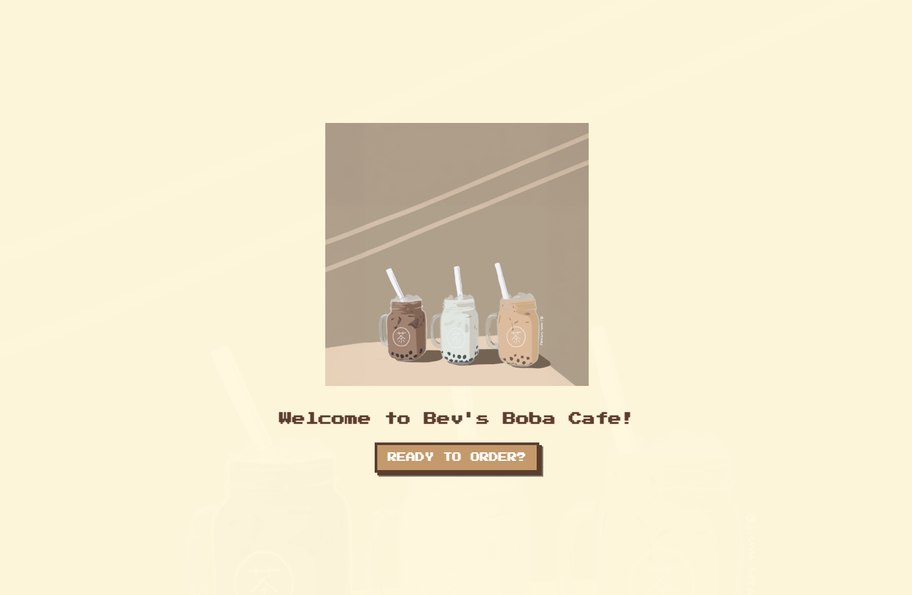

# Bev's Boba Cafe

## Overview

Welcome to Bev's Boba Cafe, a customizable and interactive bubble tea ordering experience! This project lets users craft their perfect drink with playful interactions, engaging animations, and an immersive UI inspired by early 2000s video games. Whether you're a boba enthusiast or a first-timer, this app turns ordering bubble tea into a fun, gamified journey.

This project was created to refine my design skills and provide a seamless user experience using **Figma** and **JS/HTML/CSS**.

---

## Features

### 🧸 **Interactive Enhancements**

- **Higher Color Contrast in Selected and Active Elements**: Enhances accessibility and ensures easy identification of selected options.
- **Popup for Milk Selection on Tea Choices**: When selecting Jasmine Green Tea or Classic Black Tea, a popup asks the user if they want milk. This guides the user through a more tailored, informative experience.

### 🌊 **User Flow Enhancements**

- **"Ready to Check Out" Button Conditional Visibility**: The button only appears once a tea is selected, preventing frustration from incomplete orders and guiding users through a logical checkout process.
- **Fully Reset All Values for New Order Experience**: All previous order details are refreshed, ensuring a clean slate for each new order. This enhances usability and user confidence.

### 🎨 **Button Interactions and Styling** (Desktop Only)

- **Hover Text and Styling Changes**: When users interact with the buttons on a desktop, hover effects provide immediate feedback. The button text changes and box shadows darken, signaling to the user to confirm their selection. These subtle styling changes make the interface more engaging and ensure smooth user interactions.

### 💫 **Final Scene Refinements**

- **Polaroid-inspired Bordered Background for Final Order**: A smooth ease-in effect transitions the user from the customization page to the order summary, providing closure and satisfaction.
- **Bounce Animation for Drink Elements**: Drink elements like tea, toppings, and ice bounce slightly to mimic a dynamic, "live" drink, adding a touch of interactivity and excitement to the final product.
- **Randomized Success Messages**: Fun, personalized success messages (e.g., “Yum, you’ve got great taste!” and “Perfectly brewed, perfectly you!”) appear after order completion to end the experience on a high note.

---

## Technologies Used

- **Figma**: For designing custom assets and refining UI/UX elements.
- **HTML/CSS/JS**: For web development, including animations, interactive elements, and page transitions.
- **Press Start 2P Font**: For a nostalgic, pixelated aesthetic.
- **Courier New Font**: For the receipt-style text to match the pixel theme.
